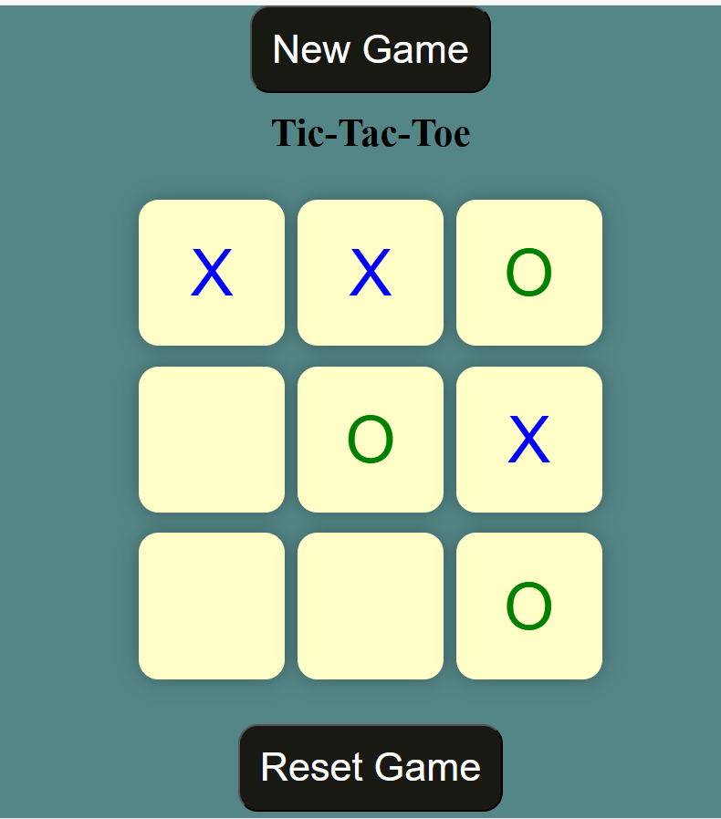
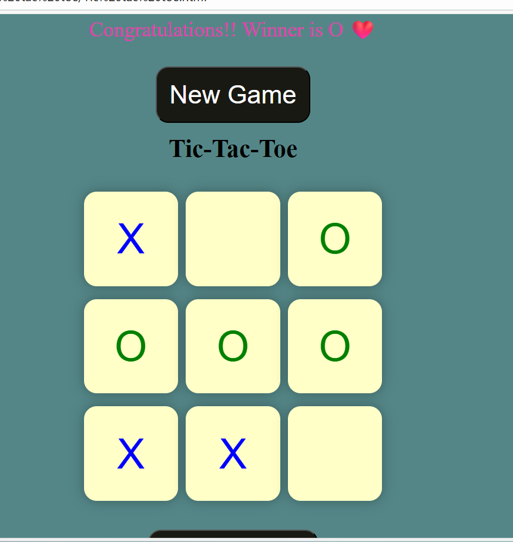
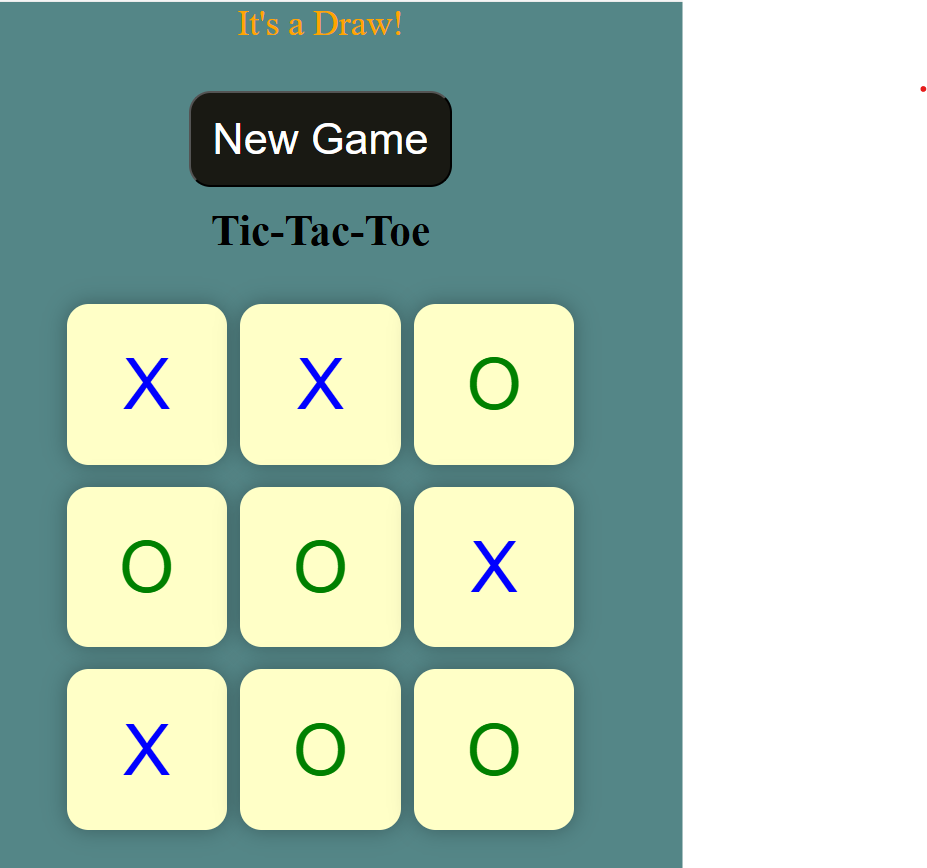

# Tic Tac Toe 🎮

A simple Tic Tac Toe game built with **HTML, CSS, and JavaScript**.

## How to Play

- Player O starts the game.
- Click a box to place your mark.
- Game announces winner or draw.
- Use "New Game" or "Reset" to play again.

## Live Demo

[Live Demo](https://farheenayy33.github.io/Tic-Tac-Toe-js/)

## Features

- Win detection
- Draw detection
- Responsive UI
- Easy restart

## Technologies

- HTML
- CSS
- JavaScript

## Screenshots

